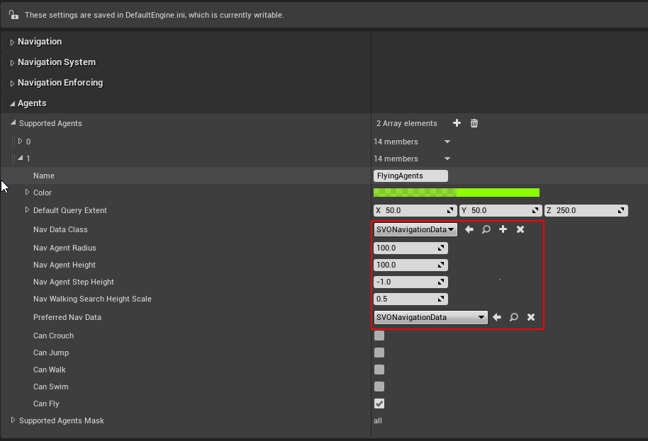
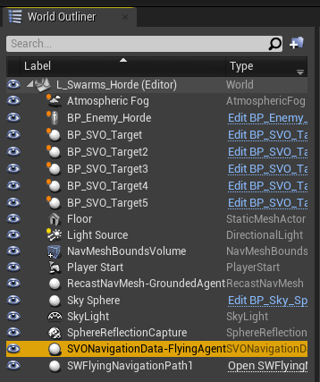
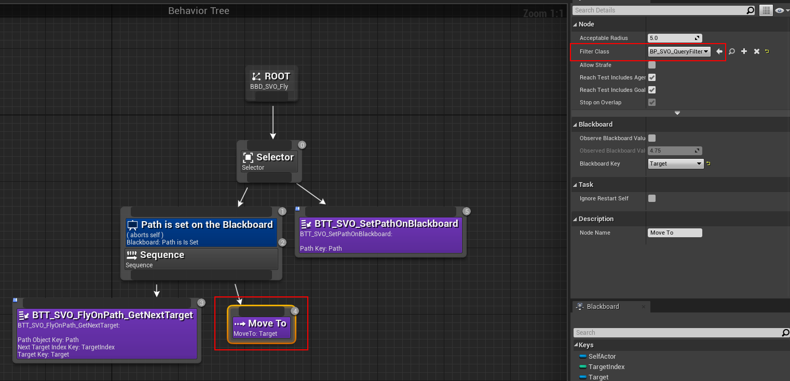

This plug-in brings 3D navigation to Unreal Engine. It's based off of this [GDC talk](https://www.gdcvault.com/play/1022016/Getting-off-the-NavMesh-Navigating), and this associated chapter in [Game AI Pro 3](https://www.gameaipro.com/GameAIPro3/GameAIPro3_Chapter21_3D_Flight_Navigation_Using_Sparse_Voxel_Octrees.pdf).

The original implementation of the algorithm comes from https://github.com/midgen/uesvon, and was heavily refactored, improved, and integrated into UE's navigation system.

# Features

## Seamless integration with UE's built-in navigation system. 
 
You don't have to use specific `MoveTo` functions in your code, but only the regular nodes nodes you're already used to use for your 2D pathfinding queries.

Pathfinding queries are automatically executed asynchronously.

Regeneration of the navigation data is automatically done whenever you move objects in the scene, and asynchronously.

## Different pathfinding algorithms

* A-Star: The fastest one, but this produces very jaggy paths.
* Theta-Star: The slowest one. It uses line-of-sight checks to remove un-necessary steps from the path.
* Lazy-Theta-Star: The default one. It's faster than Theta-Star as it generates way more line of sight checks, but the produced path is slightly less optimal.

## Debug visualizations

Debug visualization options which allow you to draw the different layers of the octree, all the free and / or occluded voxels, the active paths of the flying actors in the world. 

## Pathfinder Helper Actor

There is a Pathfinding helper actor which adds visualizations of the steps used by the pathfinding algorithm in the navigation data. That helps to understand all the paths the algorithm explore before reaching the destination. It also prints out informations about the path, such as the number of visited nodes, to help you choose the best options.

# Limitations

There are currently a few limitations to the plug-in which may be addressed in the future:

* Although the navigation data is generated asynchronously, it's done on one thread only. Given the nature of the data (in an octree), it is possible to split the workload in 8.
* No support of level streaming. It's supported in the navigation system and with the 2d navmesh, but not in this plugin currently. Though there are plans to support it, it won't be possible to connect multiple octrees together to make an actor move from one to another.
* No smoothing of the generated paths by the pathfinding algorithms. It should be possible to use an algorithm such as [Centripetal Catmull–Rom spline](https://www.wikiwand.com/en/Centripetal_Catmull%E2%80%93Rom_spline).
* Detection of the occluded voxels is currently done using the physics engine overlap detection. It should be possible to do this asynchronously, or do like with the Recast implementation: store a representation of all the triangles in the scene in a buffer, and check overlap collisions on the CPU in one of the threads generating the data.

# Usage

## Setup

The first step is to add to the Navigation System settings configuration of your flying agents.

You need to open the project settings, then click on the `Navigation System` option under the `Game` section. Then, expand the `Supported Agents` array and add your agent properties.

You must select `SVONavigationData` both for the `Nav Data Class` and the `Preferred Nav Data`.

The `Agent Radius` property is very important, as this will control the size of the smallest voxels of the navigation data. The size of the voxels will be twice the agent radius.

You can create multiple flying agents with different radii. This will make the navigation system create multiple navigation data in the level.

## Navigation Data

After you created your agent in the navigation system settings, you need to place a `Nav Mesh Bounds Volume` actor in your level, to let the navigation system create the `SVONavigationData` actor in the same level. That actor will contain the [sparse voxel octree](https://www.wikiwand.com/en/Sparse_voxel_octree) data used by the pathfinding.

It's important to note that the size of the octree generated by the plug-in won't necessarily be the same size as that volume. Indeed, because the navigation data starts with voxels with a pre-determined size (twice the agent radius), and because that navigation data is an octree, the plug-in must compute a total size that will allow the root cube to be split as many times as necessary to end up with the smallest cubes with the correct size.

You can visualize the real navigation bounds using the `Debug Infos . Debug Draw Bounds` option, as explained later.

You can click on the actor to display some options:

Even though the navigation data is generated automatically by the engine when it is added to the level, and you move actors around, it may be convenient to manually rebuild the data. You can use the 2 buttons to clear the navigation data, and rebuild it again.

You can use the `Collision Channel` setting to change the channel used by the physics engine overlap detection.

The `Clearance` option allows you to add an extra offset to the boxes used to test overlap. For example, if the agent radius is 100 units, then the smallest voxel size will be 200. If the clearance is set to 10, the size of the smallest voxels will be 210.

Explanations of the `Debug Infos` section are lower in this document, but you can `Enable Drawing` and check `Debug Draw Layers` to make sure the data has been generated. If you moved and resized the `Nav Mesh Bounds Volume` to encompass some geometry, you should see some big yellow cubes in the viewport.

## AI Controller

The last step is to setup the flying actors. 

You need to have an actor which inherit from `ACharacter`. You then need to update its `Agent Properties` to select `SVONavigationData` as their `Preferred Nav Data` class.

SCREENSHOT NEEDED

You need to create a blueprint from the class `SVONavigationQueryFilter`.

That class defines the options to use by the pathfinder. Each option may lead to more options to set up.

You can set this asset as the `Default Nav Filter Class` of the `AIController` of your flying actor.

SCREENSHOT NEEDED

When it's done, you can for example use a behavior tree to move your actor, such as the following one:

To move the actor, you just need to use the `Move To` default node, and not forget to set the `Filter Class` option in the task properties.

You can visualize the paths used by your flying agents by checking `Enable Drawing` on the SVO navigation data actor, and checking `Debug Draw Active Paths`.

# Pathfinding options

# Debugging

## SVO Data Visualization

## Pathfinding Visualization

## Console commands (???)

To display the mem used for ex